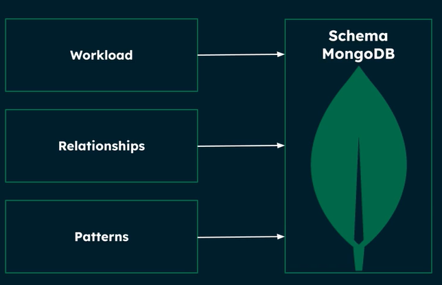

# mongodb-data-model
Repository created to show data model examples, design patterns and guidelines.
All this with the goal to help you to modelling in MongoDB the right way.

## Index
- [Overview](#overview)
    - [Golden Rule](#golden-rule)
- [Workloads](#workloads)
- [Relationships](#relationships)
- [Design Patterns](#design-patterns)
- [Anti patterns](#anti-patterns)
- [Schema lifecycle management](#schema-lifecycle-management)

## Overview
Consider to follow the three main phases:

- Define workload.
- Identifying relationships.
- Applying Design Patterns.

Reference: [Data Modeling for MongoDB Overview](https://learn.mongodb.com/learn/course/data-modeling-for-mongodb-overview/lesson-1-course-introduction)

### Golden Rule
Data that is accessed together should be stored together.

## Workloads
- Identifying and quantifying entities
- Identifying reads and writes
- Quantifying reads and writes

Reference: [Identifying Database Workloads](https://learn.mongodb.com/learn/course/identifying-database-workloads)

## Relationships
- Identifying relationships
- Embedding or referencing
- Modeling one-to-one
- Modeling one-to-many
- Modeling many-to-many

References:
- [Modeling Data Relationships](https://learn.mongodb.com/learn/course/modeling-data-relationships)
- [Guideline to define when to embed or reference](./reference-or-embed-guideline.pdf)

## Design Patterns
[Here](./design-patterns/README.md) you can see the Design Patterns you can use in MongoDB.

## Anti patterns
[Here](./anti-patterns/README.md) you can see the Design Patterns you MUST AVOID in MongoDB.

## Schema lifecycle management
[Here](./schema-lifecycle/README.md) you can see how to manage the schema lifecycle.
