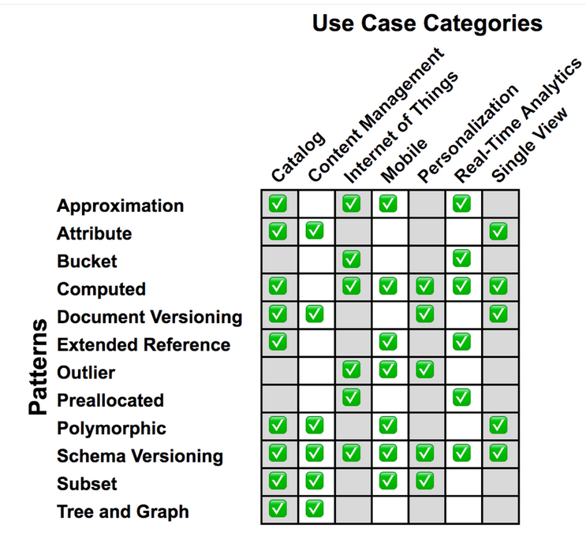

# Design Patterns

There are 12 foundational Design Patterns on MongoDB. [In this link](https://www.mongodb.com/blog/post/building-with-patterns-a-summary) you can see all details about each pattern.

Here we have more details about the most common patterns:
- [Inheritance Pattern](./inheritance-pattern/)
- [Computed Pattern](./computed-pattern/)
- [Approximation Pattern](./approximation-pattern/)
- [Extended reference pattern](./extended-reference-pattern/)
- [Schema versioning pattern](./schema-versioning-pattern/)
